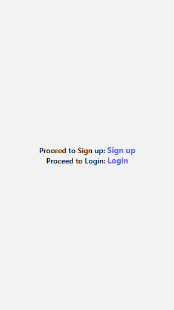
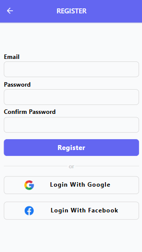
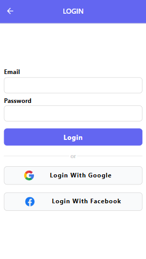

# Expo + Firebase Auth Starter 👋

🚀 Minimal Expo + Firebase Authentication setup with Email/Password, Google, and Facebook signup & login.

## Features
- 🔐 Email & Password Authentication
- 🌐 Google and Facebook Authentication
- 🎨 Clean and modern UI

## Getting Started
1. Clone or fork this repo
2. Install dependencies: `npm install`
3. Create a `.env` file and add your Firebase config following Expo’s environment rules: [Visit Expo Docs](https://docs.expo.dev/guides/environment-variables/)
4. Start the app: `npx expo start`

## Note
This starter is built with Expo, but all authentication logic is contained in the `FIREBASE/` folder — so you can easily reuse it in non-Expo React Native projects.

⭐ Don’t forget to leave a star if this helped you!

## Screenshots

  
  
  

## License

This project is licensed under the MIT License – see the [LICENSE](LICENSE) file for details.
